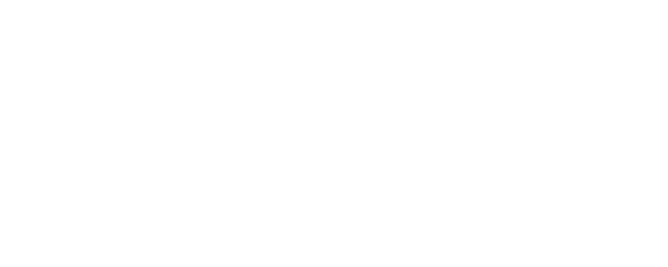

# QuizMe API


<!-- PROJECT SHIELDS -->
<!--
*** I'm using markdown "reference style" links for readability.
*** Reference links are enclosed in brackets [ ] instead of parentheses ( ).
*** See the bottom of this document for the declaration of the reference variables
*** for contributors-url, forks-url, etc. This is an optional, concise syntax you may use.
*** https://www.markdownguide.org/basic-syntax/#reference-style-links
-->
[![Contributors][contributors-shield]][contributors-url]
[![Forks][forks-shield]][forks-url]
[![Stargazers][stars-shield]][stars-url]
[![Issues][issues-shield]][issues-url]
[![MIT License][license-shield]][license-url]
[![LinkedIn][linkedin-shield]][linkedin-url]


<!-- PROJECT LOGO -->
<br />
<p align="center">
  <a href="https://ketolifeapp.herokuapp.com/">
    
  </a>
  <h3 align="center">QuizMe API</h3>
</p>


<!-- TABLE OF CONTENTS -->
## Table of Contents

* [About the Project](#about-the-project)
  * [Built With](#built-with)
* [Getting Started](#getting-started)
  * [Prerequisites](#prerequisites)
  * [Installation](#installation)
* [Usage](#usage)
* [Roadmap](#roadmap)
* [Contributing](#contributing)
* [License](#license)
* [Contact](#contact)
* [Acknowledgements](#acknowledgements)


<!-- ABOUT THE PROJECT -->
## About The Project

https://quizme.herokuapp.com/


This API was created as a part of Full Stack application for QuizMe. It was written in Javascript/Node.js and Node.js web application framework Express.js. For database, I used relational database PostgreSQL. This is a RESTful JSON API with two key resources: users and studysets. All endpoints require authentication using JSON Web Tokens (JWT), with the exception of accessing studysets, creating users, getting a word of the day which are open to the public.<!--The purpose of the following application is learning English words by playing games,
creating quizes and internalize those words by doing different activities. Going ahead it should not to be necessarily limited to english language but can be later extended to different subcategories like learning science/math/biology/preparing for exam and creating flashcards for any class etc. There are so many ideas but I am working on something simple for now.-->

### Built With

* [Node.js](https://nodejs.org/)
* [Express.js](https://expressjs.com/)
* [PostgreSQL](https://www.postgresql.org/)
* [Heroku](https://www.heroku.com/)
* [JsonSchema](https://json-schema.org/)


<!-- Collections -->
## Collections

### Users  
- Collection endpoint: ```/users```
- Singular Endpoint for all CRUD operations:```users/:username```
- Attributes:
	- name
	- username
	- password  

### Studysets  
- Collection endpoint for creating a studyset: ```/studysets```  
- Singular Endpoint for all CRUD operations of studysets:```studysets/:id```  
- Endpoint for deleting flashcard from studyset: ```studysets/flashcard/:id```  
- Access endpoint to all studysets of a user: ```studysets/:username/all```
- Attributes:
	- username
	- id(for flashcard and studyset)  

### Word of the day  
- Endpoint for getting a word of the day: ```/dailyword/word```  
- Attributes:
	- no attributes needed

<!-- USAGE EXAMPLES -->
## Usage. 


## API Schema  


 
<!-- ROADMAP -->
## Roadmap

See the [open issues](https://github.com/othneildrew/Best-README-Template/issues) for a list of proposed features (and known issues).


<!-- CONTRIBUTING -->
## Contributing

Contributions are what make the open source community such an amazing place to be learn, inspire, and create. Any contributions you make are **greatly appreciated**.

1. Fork the Project
2. Create your Feature Branch (`git checkout -b feature/AmazingFeature`)
3. Commit your Changes (`git commit -m 'Add some AmazingFeature'`)
4. Push to the Branch (`git push origin feature/AmazingFeature`)
5. Open a Pull Request


<!-- LICENSE -->
## License

Distributed under the MIT License. See `LICENSE` for more information.


<!-- CONTACT -->
## Contact

Nick Gundobin - [@my_email](https://mail.google.com/mail/u/0/?view=cm&fs=1&to=ngundobin@gmail.com&su=SUBJECT&body=BODY&bcc=ngundobin@gmail.com&tf=1) - ngundobin@gmail.com  
[@my slack](sbcommunity-sec.slack.com/U017AUYK05T) - nick_g(slack)

Project Link: [https://github.com/nikgun1984/quizme-app](https://github.com/nikgun1984/quizme-app)


<!-- ACKNOWLEDGEMENTS -->
## Acknowledgements
* [Img Shields](https://shields.io)
* [Springboard Staff](https://springboard.com)
* [othneildrew YOU ROCK!!!](https://github.com/othneildrew/Best-README-Template)
* [Heroku](https://www.heroku.com/)
* [Renish](https://github.com/renishb10)

<!-- MARKDOWN LINKS & IMAGES -->
<!-- https://www.markdownguide.org/basic-syntax/#reference-style-links -->
[contributors-shield]: https://img.shields.io/badge/contributors-2-green
[contributors-url]: https://github.com/nikgun1984/ketolife_backend/network/dependencies
[forks-shield]: https://img.shields.io/badge/forks-0-red
[forks-url]: https://github.com/nikgun1984/ketolife_backend/network/members
[stars-shield]: https://img.shields.io/badge/stars-0-blue
[stars-url]: https://github.com/nikgun1984/ketolife_backend/stargazers
[issues-shield]: https://img.shields.io/badge/issues-0-yellow
[issues-url]: https://github.com/nikgun1984/ketolife_backend/issues
[license-shield]: https://img.shields.io/badge/license-MIT-yellowgreen
[license-url]: https://github.com/nikgun1984/ketolife_backend/blob/main/README.md
[linkedin-shield]: https://img.shields.io/badge/-LinkedIn-black.svg?style=flat-square&logo=linkedin&colorB=555
[linkedin-url]: https://www.linkedin.com/in/nick-gundobin-5b905931/
[product-screenshot]: images/screenshot.png
=======
